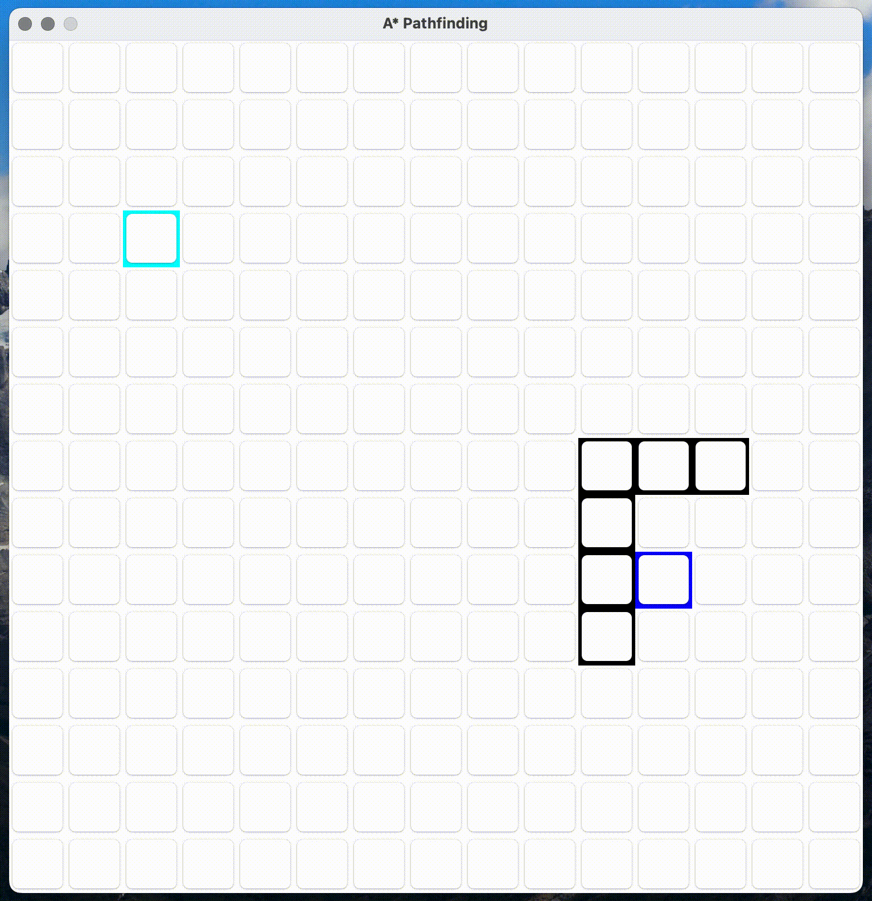

# A* Pathfinding Visualization in Java

## Features
- Visual grid-based A* pathfinding
- Start and goal node selection
- Obstacle (wall) support
- Final path drawing after goal is reached

## Algorithm in action

  

